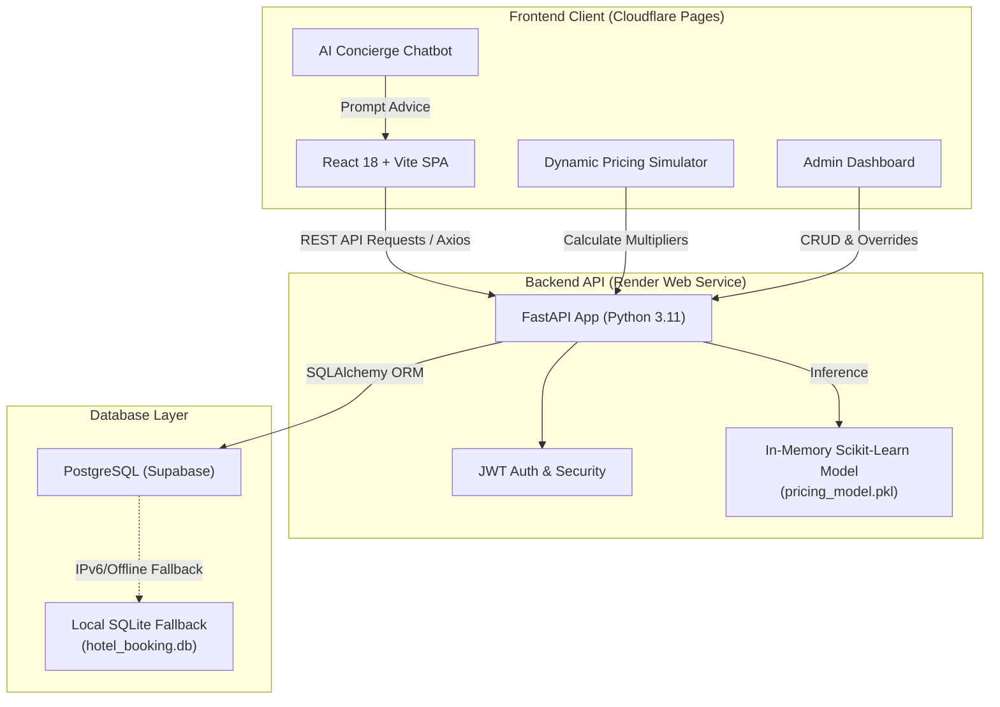

<div align="center">

# 🏨 SmartStay — Luxury Hotel Booking & Dynamic AI Pricing

> **Next-Generation Hospitality Platform powered by React, FastAPI, Scikit-Learn Machine Learning, and Cloudflare Pages.**

[](https://hotel-booking-dynamic-pricing.pages.dev/)
[](https://hotel-booking-dynamic-pricing.onrender.com)
[](https://hotel-booking-dynamic-pricing.onrender.com/docs)
[](LICENSE)

<br/>

[](https://reactjs.org/)
[](https://vitejs.dev/)
[](https://fastapi.tiangolo.com/)
[](https://python.org/)
[](https://supabase.com/)
[](https://scikit-learn.org/)

</div>

---

## 🌐 Live Deployments & Demo Links

| Resource | Direct Link | Description |
| :--- | :--- | :--- |
| **🚀 Live Application** | **[hotel-booking-dynamic-pricing.pages.dev](https://hotel-booking-dynamic-pricing.pages.dev/)** | Hosted on Cloudflare Global Edge Network |
| **⚡ Backend API Server** | **[hotel-booking-dynamic-pricing.onrender.com](https://hotel-booking-dynamic-pricing.onrender.com)** | High-performance FastAPI backend hosted on Render |
| **📖 Interactive API Docs** | **[hotel-booking-dynamic-pricing.onrender.com/docs](https://hotel-booking-dynamic-pricing.onrender.com/docs)** | OpenAPI Swagger interactive endpoint explorer |
| **📊 Dynamic Pricing Simulator**| **[hotel-booking-dynamic-pricing.pages.dev/pricing](https://hotel-booking-dynamic-pricing.pages.dev/pricing)** | Public interactive ML rate calculator & simulator |

---

## 🔑 Demo Access Credentials

> [!NOTE]
> For security and privacy, never publish personal email addresses or personal passwords on public repositories. The platform includes a sandboxed demo administrator account for testing and evaluation.

| Role | Email | Password | Access Rights |
| :--- | :--- | :--- | :--- |
| **Demo Administrator** | `admin@smartstay.com` | `Admin@123456` | Full administrative control, dynamic pricing overrides, inventory & booking management |
| **Guest User** | *Register any email or use OTP* | *Any password* | Hotel search, room booking, reservation management & AI Concierge |

---

## ✨ Key Highlights & Features

### 🌟 1. Massive Curated Inventory (70+ Luxury Stays)
- **7 Top Travel Destinations** across India: **Goa, Mumbai, Bengaluru, Delhi, Rajasthan, Kerala, and Manali**.
- Over **10+ distinct curated properties per region** (heritage palaces, beachfront pool villas, hill-station chalets, luxury business penthouses).
- Each property features real photography, rich amenity tags, localized descriptions, multiple room tiers, and customer ratings.

### 🤖 2. 24/7 Smart AI Concierge
- Integrated floating assistant widget with natural conversational guidance.
- 1-click discovery prompts: *"Recommend a luxury beach villa in Goa"*, *"Find pool suites under ₹15,000"*, *"How does AI pricing work?"*.
- Real-time navigation hooks directing guests directly to relevant hotels and room selections.

### 📈 3. Machine Learning Dynamic Pricing Engine
- Powered by a trained **Random Forest Regressor** (`pricing_model.pkl`) calculating demand-optimized rates in real-time.
- Multi-factor algorithm accounting for:
  - **Occupancy Velocity** (0% to 100% room occupancy rate).
  - **Lead Time Dynamics** (same-day booking spikes vs. early-bird discounts).
  - **Weekend & Seasonal Surges** (Fri/Sat premium, peak vacation periods).
  - **Competitor Indexing** & Star Category benchmarking.
- **Interactive Pricing Simulator** (`/pricing`) allowing users and managers to test pricing variables with visual multiplier gauges.

### 🛡 4. Enterprise-Grade Administration Suite
- **Analytics Dashboard**: Revenue breakdown, RevPAR, ADR, occupancy trends via Recharts.
- **Hotel & Room Inventory**: Real-time CRUD operations, room availability toggles, and base price adjustments.
- **Booking Management**: Status tracking (Confirmed, Pending, Cancelled) and check-in workflows.
- **Dynamic Pricing Controls**: Global minimum/maximum rate caps and manual multiplier overrides.

### 🎨 5. Luxury Dark-Mode Aesthetic
- Built with a curated obsidian, royal indigo (`#6366F1`), and warm gold/amber palette.
- Glassmorphic panels, responsive layouts across mobile/desktop, micro-animations, and fast page loads.

---

## 🏛 System Architecture



---

## 🛠 Tech Stack

### Frontend
- **Framework**: [React 18](https://react.dev/) + [Vite 5](https://vitejs.dev/)
- **Routing**: [React Router v6](https://reactrouter.com/)
- **Styling**: Tailwind CSS + Custom CSS Design System
- **Data Visualization**: [Recharts](https://recharts.org/)
- **Icons**: [Lucide React](https://lucide.dev/)
- **Deployment**: [Cloudflare Pages](https://pages.cloudflare.com/) (Edge CDN with SPA redirect rules)

### Backend
- **Framework**: [FastAPI](https://fastapi.tiangolo.com/) (Async ASGI)
- **Server**: [Uvicorn](https://www.uvicorn.org/)
- **ORM & Database**: [SQLAlchemy 2.0](https://www.sqlalchemy.org/) with PostgreSQL / SQLite support
- **Authentication**: JWT Bearer Tokens (`python-jose`), `passlib[bcrypt]`, HMAC-SHA256 OTP verification
- **Deployment**: [Render](https://render.com/)

### Machine Learning
- **Library**: [Scikit-Learn](https://scikit-learn.org/) + [NumPy](https://numpy.org/)
- **Model**: Trained Random Forest Regressor serialized as `pricing_model.pkl`

---

## 🚀 Local Development Setup

### 1. Prerequisites
- **Node.js** (v18 or higher)
- **Python** (v3.10 or higher)
- **Git**

### 2. Clone the Repository
```bash
git clone https://github.com/Manasa-L-Hegde/hotel-booking-dynamic-pricing.git
cd "hotel-booking-dynamic-pricing"
```

### 3. Backend Setup
```bash
# Create and activate virtual environment (optional but recommended)
python -m venv venv
# On Windows:
.\venv\Scripts\activate
# On macOS/Linux:
source venv/bin/activate

# Install Python dependencies
pip install -r requirements.txt

# Run initial database seed (creates 70 hotels and sets admin credentials)
npm run seed:admin

# Start the FastAPI backend (runs on http://localhost:5000)
npm run server
```

### 4. Frontend Setup
In a separate terminal:
```bash
# Install frontend dependencies
npm install

# Start Vite development server (runs on http://localhost:5173)
npm run dev
```

Visit **`http://localhost:5173`** in your browser to experience the platform locally!

---

## 📡 API Endpoint Overview

| Method | Endpoint | Description | Protected |
| :--- | :--- | :--- | :---: |
| `POST` | `/api/auth/register` | Register a new customer | No |
| `POST` | `/api/auth/login` | Login and obtain JWT token | No |
| `GET` | `/api/auth/me` | Fetch authenticated user profile | Yes |
| `GET` | `/api/hotels` | List all hotels (supports city filter & search) | No |
| `GET` | `/api/hotels/{id}` | Get detailed hotel info with available rooms | No |
| `POST` | `/api/hotels` | Create a new hotel | Admin Only |
| `POST` | `/api/pricing/calculate`| Calculate real-time dynamic room price | No |
| `GET` | `/api/bookings` | List customer bookings or all bookings | Yes |
| `POST` | `/api/bookings` | Create a new room booking | Yes |
| `GET` | `/api/analytics/dashboard`| Aggregate revenue, occupancy, and KPIs | Admin Only |

Interactive Swagger documentation is available at **`/docs`**.

---

## 📄 License

This project is licensed under the [MIT License](LICENSE).

---

<div align="center">
  <sub>Engineered with ❤️ by Manasa L Hegde for SmartStay Luxury Stays & Dynamic Hospitality.</sub>
</div>
